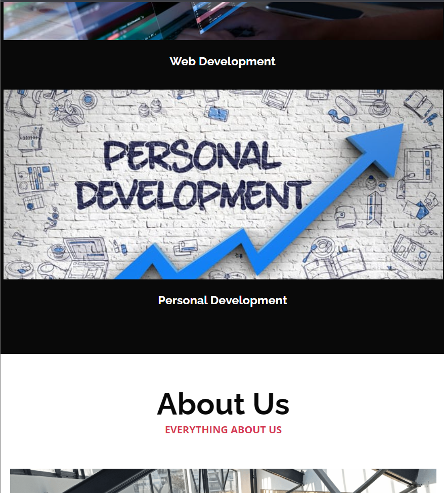

# RESPONSIVE DESIGN

## About

Responsive Design is a a project created by the ALU's staff for ALU's students to practive responsiveness of
webpages

## Website (Desktop screen)

## Website (Tablette and Phone Screen)

